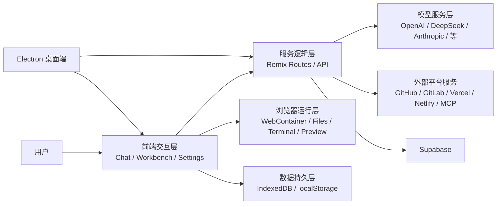
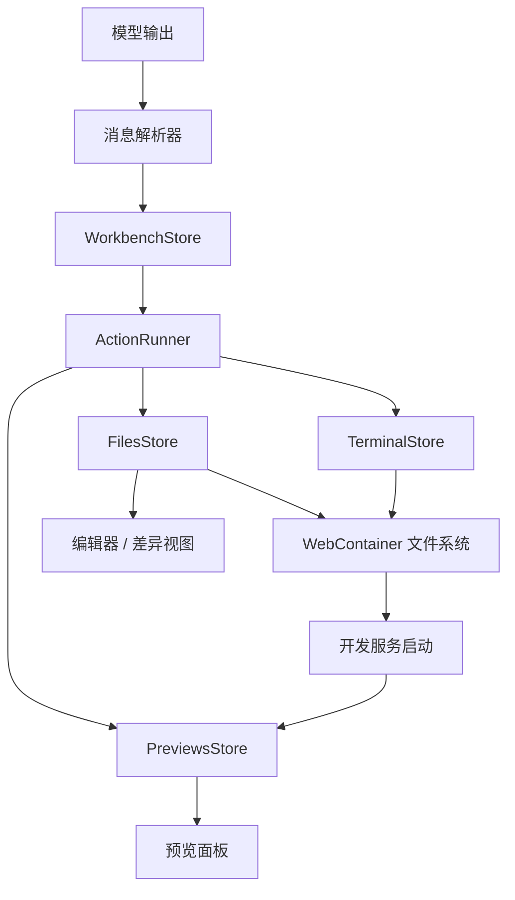
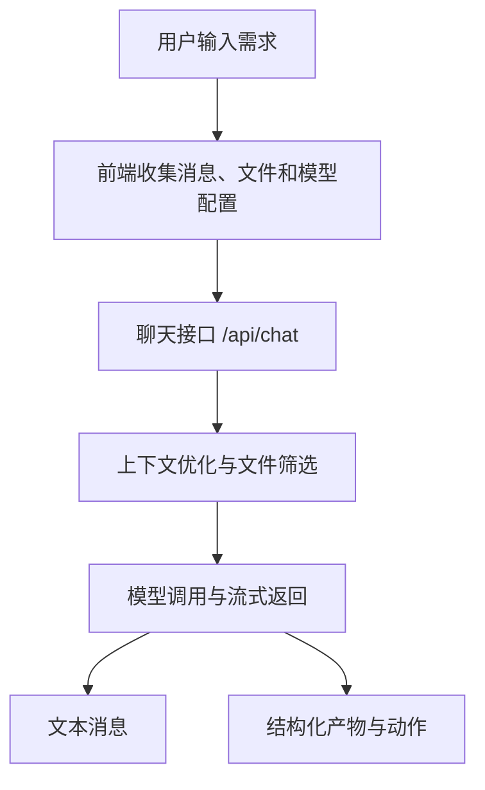
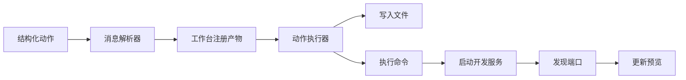
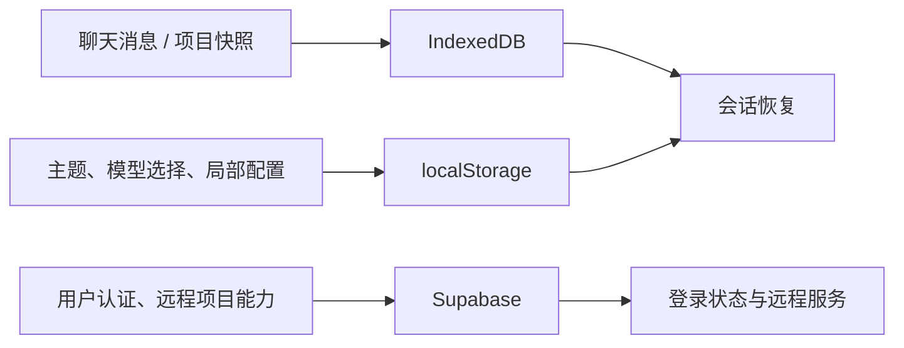

# 第四章 系统设计

第三章已经从需求层面对平台的目标与边界进行了分析，本章进一步回答“系统准备怎样实现这些需求”。与普通内容管理系统或信息展示网站不同，本文平台需要同时处理自然语言输入、模型调用、结构化结果解析、浏览器端运行、实时预览、会话持久化以及桌面端扩展等问题，因此系统设计不能简单套用传统前后端分离模式，而应围绕“开发闭环”来组织架构。

换言之，本章的重点不是把系统机械拆成若干功能点，而是说明各模块如何围绕同一条主线协同工作。对于本文平台而言，这条主线就是：用户描述需求，平台组织上下文并调用模型，模型返回文本和结构化动作，运行时将动作落到项目文件与命令执行层，工作台再把结果反馈给用户，由此形成持续迭代的开发过程。

## 4.1 总体架构设计

### 4.1.1 设计思路

从项目实际实现出发，本文采用的是一种偏“前端闭环”的架构思路。系统虽然保留了 Remix 路由与服务端接口层，但真正与一般 AI 聊天应用拉开差异的部分并不在单纯的接口转发，而在于浏览器端存在一个可运行的工程环境。也就是说，系统不是把模型结果返回给用户后就结束，而是尽可能在当前平台内继续完成文件写入、依赖安装、服务启动和预览反馈。

基于这一思路，系统整体被划分为五个层次：前端交互层、服务逻辑层、浏览器运行层、数据持久层和桌面扩展层。这样的划分并不是为了追求形式上的分层完整，而是因为这五部分刚好对应系统的五类核心职责。前端交互层负责承接用户操作并展示平台状态；服务逻辑层负责模型调用、配置整合与外部平台接口适配；浏览器运行层负责让生成结果真正变成一个可执行项目；数据持久层负责保存会话、快照和配置；桌面扩展层则负责将系统迁移到 Electron 环境中运行。

其中最关键的一点在于，服务逻辑层和浏览器运行层是并行参与主流程的。前者负责“理解和生成”，后者负责“执行和验证”，二者通过消息解析器、工作台状态和动作执行机制连接起来。这也是本文平台不同于普通对话式 AI 工具的根本原因。

### 4.1.2 系统总体架构

图 4-1 为系统总体架构图。

这张图中有两条最重要的链路。第一条是“前端交互层 - 服务逻辑层 - 模型服务层”，它负责完成自然语言理解、上下文组织和结果生成；第二条是“前端交互层 - 浏览器运行层”，它负责把生成结果进一步转换成文件、命令和预览页面。若只有前一条链路，系统最多只是一个代码生成助手；若再加上后一条链路，系统才真正具备“从需求到运行”的闭环能力。

Draw.io 绘图说明：
一个五层横向架构图，最左侧是“用户”，中间依次是“前端交互层”“服务逻辑层”“浏览器运行层”“数据持久层”，右侧外接“模型服务层”“外部平台服务”“Supabase”，上方或右下角再增加“Electron 桌面端”指向前端与服务逻辑层。

## 4.2 核心模块设计

### 4.2.1 交互与生成模块

交互与生成模块是平台最直接面向用户的部分，主要由聊天区、模型选择区、提示增强入口以及消息展示区组成。该模块承担的首要任务是把用户的自然语言输入组织成可提交给模型的请求。与普通聊天系统不同，这里的请求并不只包含一段提示词，还需要结合已有聊天消息、当前项目文件、上下文优化策略、模型配置以及可能的外部工具能力。

在实际设计中，这一模块并不负责直接修改项目文件，而是把模型返回的内容进一步分流处理。普通文本被保留在对话区中，结构化的产物和动作则被交给消息解析器与工作台处理。这样做的好处是清楚地区分了“模型说了什么”和“系统做了什么”，避免将生成逻辑与执行逻辑混在一起。

考虑到项目已经支持多模型能力，交互与生成模块还必须承担模型切换与配置感知的职责。前端并不直接关心每一个模型供应商的细节差异，而是通过统一的模型配置对象与后端接口协作，这为后续模型扩展保留了足够空间。

### 4.2.2 浏览器运行与工作台模块

浏览器运行与工作台模块是本文平台设计中最需要重点展开的部分，也是整个平台最具辨识度的地方。因为论文题目虽然强调“基于 Remix 框架”，但真正体现系统特色的，其实是模型生成结果如何在浏览器内部被继续执行。

该模块以 WebContainer 为运行核心，在其外部又组织了文件存储、动作执行、终端输出、预览管理和编辑器联动等一系列能力。用户在聊天区发出需求后，模型会返回带有文件动作和命令动作的结构化结果；消息解析器识别这些结构后，工作台将其注册为待执行任务，随后由动作执行器按顺序完成文件写入、安装依赖、运行项目和更新预览等操作。此时，用户不仅能看到“模型给出的答案”，还能看到系统在工作台中确实创建了哪些文件、运行了哪些命令、当前项目启动到哪一步。

图 4-2 为浏览器运行层与工作台联动关系图。

这部分设计有两个值得强调的点。第一，系统不是把聊天输出当作最终结果，而是把它当作运行时输入；第二，工作台不是附属界面，而是整个执行链的可视化载体。正因为如此，文件树、编辑器、终端和预览面板在本文平台中并不是为了“看起来像 IDE”，而是为了让自动化过程变得可见、可解释、可干预。

Draw.io 绘图说明：
以“模型输出”为起点，经过“消息解析器”“WorkbenchStore”“ActionRunner”，向下连接“FilesStore”“TerminalStore”“PreviewsStore”，底部是“WebContainer 文件系统”和“开发服务”，右侧是“预览面板”，左侧是“编辑器/差异视图”。整体应表现为一个自上而下的执行链。

### 4.2.3 数据与平台扩展模块

如果说前两个模块决定了平台能否完成开发闭环，那么数据与平台扩展模块决定了这个平台是否具备持续使用价值。本文在设计上没有采用“所有数据统一进远程数据库”的重模式，而是基于项目实际实现，选择了“本地持久化优先，远程服务辅助”的思路。

聊天记录和项目快照主要保存在 IndexedDB 中，因为这类数据更新频繁、与当前浏览器运行环境绑定紧密，放在本地更有利于快速恢复；部分配置项放在 localStorage 中，以便高频读取和跨页面共享；用户认证和少量远程能力则交由 Supabase 处理。这种设计避免了在毕业设计阶段引入复杂的远程业务数据体系，同时又保留了账户识别和远程服务接入能力。

此外，GitHub、GitLab、Vercel、Netlify 和 MCP 等外部平台能力并未与主流程深度耦合，而是通过设置面板和独立接口层接入。这样做的好处是，主流程保持相对干净，扩展能力可以按需启用，不会把平台变成一个难以维护的“大一统接口集合”。

桌面端扩展同样遵循最小侵入原则。Electron 只负责补足桌面应用需要的窗口管理、协议处理和生命周期能力，而核心界面和业务逻辑依然保持在 Remix 与 React 主体中。这使得系统既能作为 Web 平台使用，又能迁移为桌面应用，而不必维护两套完全不同的代码结构。

## 4.3 关键流程设计

系统设计中如果只有模块划分，而没有流程说明，就容易变成静态罗列。对于本文平台而言，更能体现设计合理性的，其实是主流程是否清晰、模块之间的边界是否明确。因此，本节重点围绕三个关键流程展开。

### 4.3.1 需求输入与模型生成流程

用户提出需求后，系统首先在前端收集当前会话消息、已有文件、模型配置以及可选的上下文增强信息，然后将这些内容提交给聊天接口。服务逻辑层在收到请求后，不会立刻把消息原样发送给模型，而是先根据文件数量、历史消息长度和上下文优化开关决定是否需要生成摘要、筛选上下文文件以及挂载工具能力。完成这些预处理后，系统才向模型发起流式调用，并将返回结果按文本、进度标记和结构化产物进行拆分。

图 4-3 为需求输入与模型生成流程图。

在这个流程中，上下文组织是设计重点。因为系统面向的是项目级任务，如果把全部聊天记录和全部文件一次性提交给模型，不仅成本高，也容易降低生成质量。因此，设计上需要让模型调用模块具备一定的上下文选择能力，而不是简单做一个请求转发器。

Draw.io 绘图说明：
一个自上而下的流程图，从“用户输入需求”开始，依次是“收集上下文”“调用聊天接口”“上下文优化”“模型流式返回”，最后分叉成“文本消息”和“结构化动作”。

### 4.3.2 代码落地与运行预览流程

模型返回结构化动作后，系统真正进入区别于普通对话产品的阶段。消息解析器会从返回结果中提取文件动作和命令动作，工作台将这些动作注册为产物状态，动作执行器再按照顺序完成文件写入、构建安装和服务启动等任务。服务启动成功后，预览管理模块识别可用端口并更新预览面板，终端模块则同步展示执行过程中的输出信息。

这一流程说明，本文平台的“运行”并不是一个独立按钮触发的附加步骤，而是生成链路的一部分。设计上将代码落地、命令执行和预览刷新串成连续过程，能显著降低用户从“看到结果”到“验证结果”之间的断层感。

### 4.3.3 会话恢复与外部协作流程

除主生成链路外，会话恢复与外部协作也是系统设计里不可忽略的部分。因为本平台并不是一次性演示工具，用户往往会在多轮会话中逐步修改项目，甚至在不同时间重新打开原有聊天继续工作。因此系统在消息变化或项目状态发生关键更新时，会同步保存聊天记录与项目快照。用户再次进入某一会话时，系统会优先恢复消息历史，再根据快照重建文件状态，使平台能较平滑地回到上一次工作上下文。

在外部协作方面，部署流程与仓库接入流程被设计为相对独立的扩展链路。它们以当前项目文件为输入，由接口层负责适配不同平台的差异。这样既避免了主工作台逻辑过度膨胀，也使系统在需要发布、导入或连接外部服务时具备清晰的调用边界。

## 4.4 数据存储与接口设计

### 4.4.1 数据存储设计

本文平台的数据设计并不追求传统意义上的完整业务库建模，而是服务于真实使用路径。围绕这一原则，平台采用了混合存储方案。

图 4-4 为系统数据存储结构图。

IndexedDB 主要承载聊天记录和项目快照，这是因为这类数据和当前浏览器环境高度相关，而且读写频繁，适合本地保存。localStorage 则用于保存模型选择、连接状态和界面配置等轻量数据，追求的是读取简单和即时生效。Supabase 的职责相对克制，主要承担用户认证和部分远程服务支撑，而不是托管整个平台的全部开发状态。

这样的数据设计更贴近当前项目真实实现，也比“先设计一套庞大的数据库表结构，再去找有没有对应功能”要合理得多。对于毕业设计论文而言，这种方案既真实，也更容易答辩。

Draw.io 绘图说明：
三个并列数据源：“IndexedDB”“localStorage”“Supabase”，分别由不同类型数据输入，再向“会话恢复”“登录状态与远程服务”“工作台恢复”等节点输出，表现为本地与远程混合存储模型。

### 4.4.2 接口设计

从接口形态看，系统并没有采用典型的资源型 CRUD 接口组织方式，而是更贴近业务动作。最核心的接口是聊天接口，它负责接收消息、文件、模型配置和上下文优化参数，并返回流式结果。与其配套的还有模型列表接口、搜索与增强输入接口、部署接口、Supabase 相关接口以及治理与诊断类接口。

这类设计的特点是“围绕平台行为组织接口”。例如，聊天接口本质上是一次生成任务入口；Vercel 和 Netlify 接口本质上是部署动作入口；Supabase 相关接口则是远程能力代理入口。这样设计的好处在于接口语义清晰，前端不需要理解每个平台底层差异，只需要按平台能力边界调用对应接口即可。

对于论文写作来说，这里没有必要把每个接口都展开成很细的输入输出表，否则容易重新陷入“列清单”的写法。保留接口分类、核心职责和设计原则即可，后续在系统实现章节再选择关键接口展开说明，会更自然。

## 4.5 安全与异常处理设计

系统设计还必须回答一个问题：当模型生成结果不稳定、外部平台调用失败或者运行环境抛出异常时，平台是否还能维持可用。对于本文平台而言，这一点尤其重要，因为平台本身就处在“模型生成”和“代码执行”两类高不确定性场景的交叉点上。

首先，在运行环境安全方面，系统通过 WebContainer 将文件写入、依赖安装和命令执行尽量限制在浏览器沙箱内部，避免模型生成代码直接影响宿主系统。其次，在配置与凭证处理方面，模型密钥、平台令牌和认证状态被尽量收敛到设置面板、受控状态存储和接口代理层中处理，降低前端直接暴露敏感能力的风险。

再者，系统强调“尽早发现、明确提示、允许恢复”的异常处理原则。模型调用失败时，错误信息应在聊天区可见；命令执行失败时，错误应反馈到终端或工作台告警区域；预览服务发生异常时，应有相应提示而不是无反馈空白。与此同时，文件锁定、差异视图和串行执行机制也用于减少模型自动改写与用户手工编辑之间的冲突。

这些设计虽然不如功能模块那样显眼，却直接决定了平台是否像一个可用系统，而不仅仅是一个“能跑通演示流程”的原型。

## 4.6 本章小结

本章围绕平台如何支撑“自然语言驱动开发闭环”这一目标，给出了系统设计方案。与原始的功能堆叠式设计不同，本文将系统组织为前端交互层、服务逻辑层、浏览器运行层、数据持久层和桌面扩展层，并进一步说明了交互与生成、浏览器运行与工作台、数据与平台扩展三类核心模块的协作关系。

在此基础上，本章又从需求输入与模型生成、代码落地与运行预览、会话恢复与外部协作三个角度说明了关键流程，并给出了本地与远程混合的数据存储思路以及围绕业务动作组织的接口设计方式。最后，结合运行环境隔离、凭证处理、异常反馈和状态一致性等内容，补充了系统安全与异常处理设计。

总体来看，这一设计既能够覆盖论文所要求的系统性内容，也比较贴近项目当前真实实现。下一章将在此基础上进一步说明各模块的具体实现过程。

## 附：本章建议绘制的图

如果你后续准备在 draw.io 中重新绘制，本章最建议保留以下 4 张图：

1. 图 4-1 系统总体架构图  
描述：表现用户、前端交互层、服务逻辑层、浏览器运行层、数据持久层、模型服务、外部平台服务、Supabase 和 Electron 之间的关系。

2. 图 4-2 浏览器运行层与工作台联动图  
描述：表现消息解析器、WorkbenchStore、ActionRunner、FilesStore、TerminalStore、PreviewsStore 与 WebContainer 的协作关系。

3. 图 4-3 需求输入与模型生成流程图  
描述：表现用户输入、上下文组织、聊天接口、上下文优化、模型流式返回，以及文本消息和结构化动作分流的过程。

4. 图 4-4 数据存储结构图  
描述：表现 IndexedDB、localStorage 和 Supabase 分别承载哪些数据，以及它们如何服务于会话恢复、配置恢复和用户认证。
