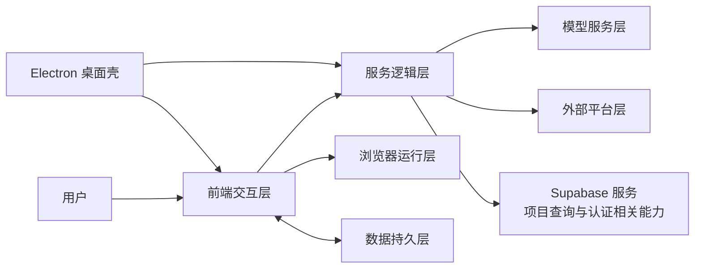
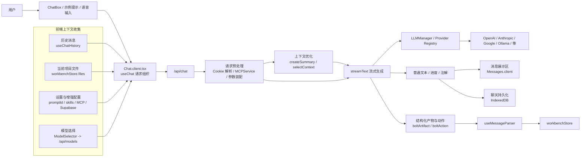
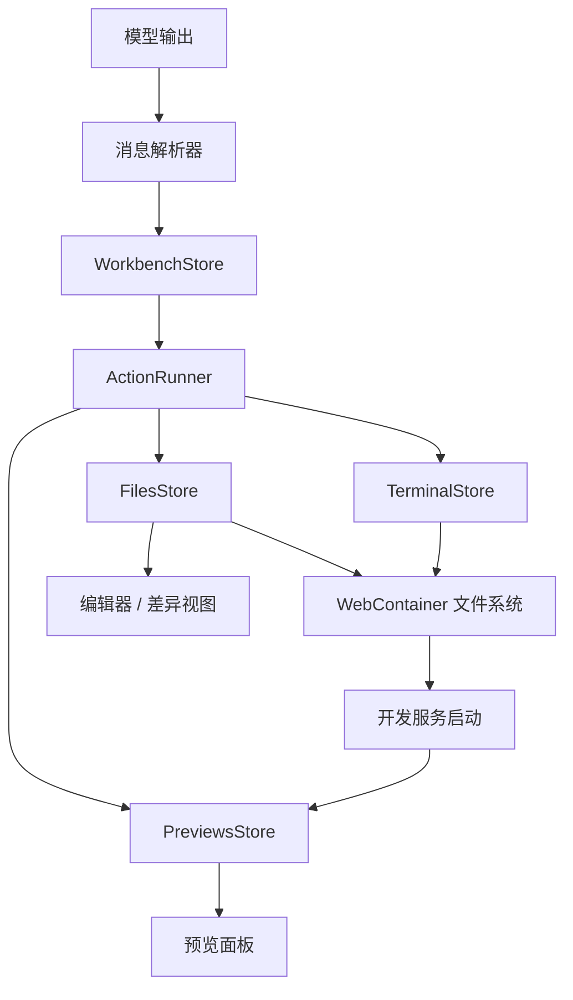
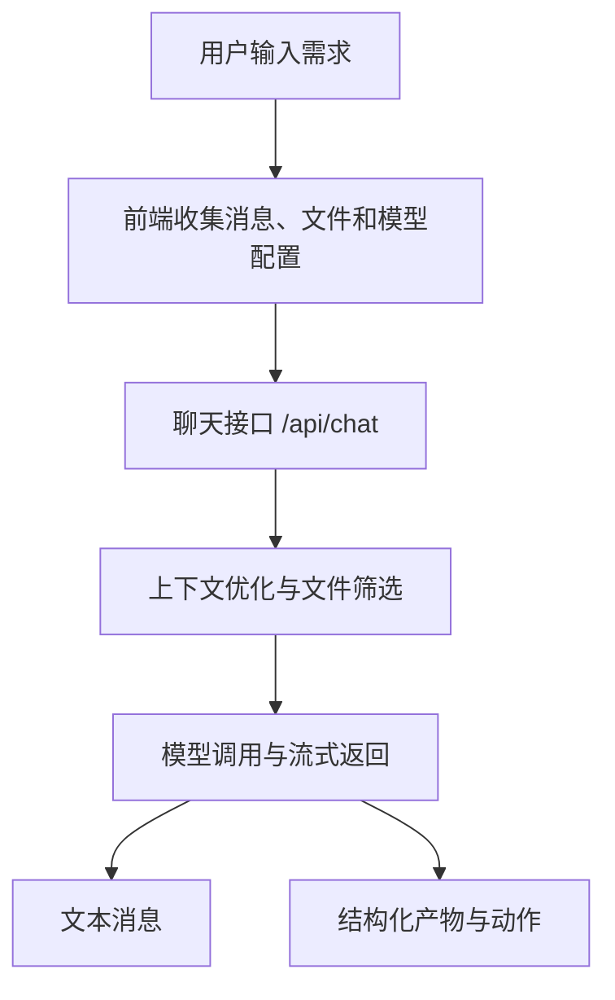
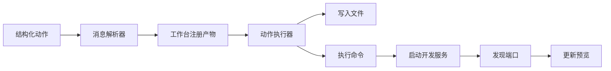
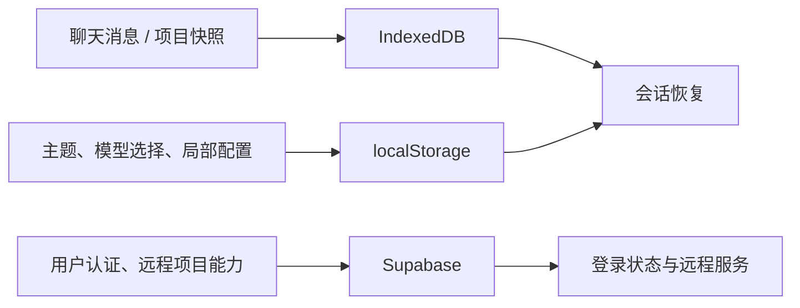

# 第四章 系统设计

第三章已从需求层面对平台的建设目标、核心功能与约束条件进行了分析。本章在此基础上进一步说明系统的总体设计方案，重点阐述系统架构、核心模块、关键业务流程、数据存储与接口组织方式，以及安全与异常处理机制。由于本文研究对象并非单一的信息展示系统，而是一个集自然语言交互、代码生成、浏览器端运行、实时预览、状态持久化与桌面端扩展于一体的智能辅助平台，因此系统设计需要围绕“需求描述—代码生成—运行验证—反馈迭代”的完整闭环展开。

与传统 Web 系统相比，本文系统设计的关键不在于简单划分前端与后端职责，而在于如何将模型生成链路与运行验证链路有效衔接，使平台既能够理解用户意图，又能够将生成结果转化为可运行、可观察和可继续修改的工程产物。基于这一设计目标，本文从总体架构、模块协同与关键流程三个层面展开系统设计。

## 4.1 总体架构设计

### 4.1.1 设计原则

本文系统设计遵循以下原则。

第一，围绕开发闭环组织架构。系统不以“生成代码”为终点，而是将代码落地、命令执行、运行预览和结果反馈纳入统一流程，使平台具备从需求输入到结果验证的连续能力。第二，保证职责边界清晰。自然语言处理、动作执行、状态管理、数据持久化和外部平台接入分别由不同层次承担，避免在实现过程中形成高耦合结构。第三，兼顾本地即时性与远程扩展性。对于会话、快照和界面配置等高频数据，优先采用本地存储；对于身份认证和部分外部能力，则通过远程服务支撑。第四，保持运行环境的可迁移性。系统主体逻辑尽量保持在 Remix 与 React 侧，通过适配层对浏览器端运行环境和 Electron 桌面端进行封装，以提升系统后续扩展能力。

基于上述原则，本文形成了由前端交互层、服务逻辑层、浏览器运行层、数据持久层和桌面扩展层共同组成的总体架构。其中，前端交互层负责承接用户操作并提供统一工作界面；服务逻辑层负责模型调用、上下文组织和外部平台接口适配；浏览器运行层负责文件落地、命令执行与预览更新；数据持久层负责会话、快照和配置保存；桌面扩展层负责将系统迁移到桌面环境中运行。

### 4.1.2 总体架构说明

图 4-1 为系统总体架构图。

从图 4-1 可以看出，系统内部存在两条核心链路。其一是“前端交互层—服务逻辑层—模型服务层”构成的语义生成链路，负责完成需求接收、上下文组织、模型推理和结果返回；其二是“前端交互层—浏览器运行层”构成的执行验证链路，负责将模型返回的结构化结果转化为文件写入、命令执行和运行预览。二者通过消息解析器、工作台状态与动作执行机制相互连接，从而形成完整的开发闭环。

这一架构使系统具备两个方面的优势。一方面，模型生成与运行验证被纳入同一平台内部，避免了传统 AI 工具中“生成结果与执行环境脱节”的问题；另一方面，各层之间仍保持相对清晰的职责边界，为模型扩展、平台接入和桌面端迁移提供了结构基础。

Draw.io 绘图说明：
建议绘制一个横向分层架构图。最左侧为“用户”，中间为“前端交互层”“服务逻辑层”“浏览器运行层”“数据持久层”，右侧连接“模型服务层”“外部平台服务”“Supabase”，并在图的上方或右下方增加“Electron 桌面端”指向前端交互层与服务逻辑层。

## 4.2 核心模块设计

### 4.2.1 交互与生成模块设计

交互与生成模块是系统面向用户的主要入口，用于承接自然语言需求输入并组织模型请求。该模块主要由聊天区、消息展示区、模型选择区以及提示增强入口组成，其核心任务是将用户输入、历史消息、当前项目文件、模型配置及相关上下文组织为可提交给模型的请求数据。

该模块在设计上不直接负责项目文件修改，而是将模型返回结果进行分流处理。对于普通文本响应，系统将其保留在对话区展示；对于结构化产物和动作信息，则交由消息解析器与工作台进一步处理。这种设计有助于明确区分“模型生成结果”与“系统执行动作”，从而降低主流程内部的耦合程度。

同时，考虑到系统支持多个模型供应商，交互与生成模块还需要感知模型配置和切换状态。前端不直接处理不同模型提供商的底层参数差异，而是通过统一模型配置对象与服务端接口协同完成请求组织，这为后续扩展新的模型提供商提供了便利。

图 4-2 为交互与生成模块细化设计图。

该图强调了交互与生成模块内部的两次分流。第一次分流发生在前端请求组织阶段，即聊天消息、项目文件、模型配置和增强能力被统一汇入 `useChat` 的请求体；第二次分流发生在模型流式返回之后，即普通文本继续保留在对话区，而结构化产物被送入消息解析器与工作台。这样的设计既保留了聊天界面的连续性，也为后续文件写入和命令执行留出了清晰的接口边界。

Draw.io 绘图说明：
建议绘制一个横向数据流图。左侧为“用户输入”和“前端上下文收集”，中间为“/api/chat”“请求预处理”“上下文优化”“流式生成”，右侧分叉为“文本消息展示”和“结构化产物进入工作台”两条输出链。图中可显式标注 `useChat`、`createSummary`、`selectContext`、`LLMManager` 与 `useMessageParser` 等真实模块名，以体现与代码实现的一致性。

### 4.2.2 浏览器运行与工作台模块设计

浏览器运行与工作台模块是本文系统设计的核心组成部分。该模块以 WebContainer 为运行环境，在其外部组织文件状态管理、动作执行、终端输出、预览管理和编辑器联动等能力，使模型生成结果能够在浏览器内部继续完成工程化落地。

在具体流程中，模型返回的结构化结果首先由消息解析器进行识别与拆分，随后工作台注册相应产物状态，并由动作执行器按顺序完成文件写入、依赖安装、命令执行和服务启动。服务启动后，预览管理模块负责感知可用端口并更新预览面板，终端模块同步显示执行过程中的状态信息与日志输出。这样，用户不仅能够看到模型返回的文本内容，还能够在工作台中观察文件变化、执行过程和运行结果。

图 4-3 为浏览器运行层与工作台联动关系图。

从系统设计角度看，该模块的重要性体现在两个方面。第一，系统将模型输出视为运行时输入，而非最终结果，从而实现从“文本生成”到“工程执行”的过渡；第二，工作台作为执行过程的可视化载体，使文件树、编辑器、终端与预览面板共同参与平台主流程，提高了系统的可观察性和可控性。

Draw.io 绘图说明：
建议绘制一个纵向执行链图，以“模型输出”为起点，依次经过“消息解析器”“WorkbenchStore”“ActionRunner”，再分支连接“FilesStore”“TerminalStore”“PreviewsStore”，底部连接“WebContainer 文件系统”和“开发服务启动”，右侧连接“预览面板”，左侧连接“编辑器/差异视图”。

### 4.2.3 数据与平台扩展模块设计

数据与平台扩展模块主要负责会话持久化、配置保存、用户认证以及外部平台能力接入。结合系统实际实现，本文未采用完全依赖远程数据库的设计，而是选择“本地存储为主、远程服务为辅”的混合方案。

其中，聊天记录与项目快照主要保存于 IndexedDB，以满足高频读写和快速恢复的需求；模型选择、主题配置及部分连接状态等轻量数据则保存在 localStorage 中，以便即时读取和跨页面共享；用户认证与部分远程能力则由 Supabase 提供支撑。该设计既避免了在研究阶段构建复杂远程业务数据库，也保留了账户识别和外部服务协同能力。

在平台扩展方面，GitHub、GitLab、Vercel、Netlify 与 MCP 等能力通过设置面板与独立接口层接入，而不直接嵌入聊天主流程。这种方式有助于维持主流程结构的清晰性，同时使系统能够根据需要加载和扩展外部能力。Electron 桌面端扩展也遵循最小侵入原则，即仅由主进程补足窗口管理、协议处理和生命周期能力，而核心界面与主体业务逻辑仍保留在 Web 系统中。

## 4.3 关键流程设计

仅有模块划分并不足以完整说明系统设计的合理性，关键业务流程的组织方式同样重要。对于本文系统而言，需求输入、模型生成、代码落地、运行预览、会话恢复和外部协作共同构成平台的主要运行路径。因此，本节围绕三个关键流程展开说明。

### 4.3.1 需求输入与模型生成流程

用户输入需求后，前端首先收集当前会话消息、已有文件、模型配置以及可选的上下文增强信息，并将这些内容提交至聊天接口。服务逻辑层接收到请求后，并不直接将原始消息发送给模型，而是根据消息长度、文件规模和上下文优化开关判断是否需要生成摘要、筛选上下文文件以及挂载工具能力。完成预处理后，系统向模型发起流式调用，并将返回结果按文本信息、进度标记和结构化产物进行拆分。

图 4-4 为需求输入与模型生成流程图。

该流程的设计重点在于上下文组织机制。由于系统面向的是项目级任务，若将全部聊天记录与全部文件内容无差别提交给模型，不仅会增加调用成本，还可能降低生成结果质量。因此，本文在模型调用前设置了上下文筛选与摘要机制，以保证模型输入在信息充分与推理效率之间取得平衡。

Draw.io 绘图说明：
建议绘制一个自上而下的流程图，依次包括“用户输入需求”“前端收集上下文”“聊天接口”“上下文优化”“模型调用与流式返回”，最后分叉为“文本消息”和“结构化动作”。

### 4.3.2 代码落地与运行预览流程

当模型返回结构化动作后，系统即进入代码落地与运行阶段。消息解析器从返回结果中提取文件动作和命令动作，工作台将其注册为待执行产物，随后动作执行器按照顺序完成文件写入、依赖安装、启动服务等任务。服务启动后，预览管理模块识别可用端口并刷新预览面板，终端模块则负责同步展示运行过程中的输出信息。

该流程表明，运行与预览并非聊天功能之外的附加能力，而是平台主流程的重要组成部分。正是由于代码落地、命令执行与结果反馈被设计为连续链路，系统才能实现从需求描述到可运行页面的快速转换。

### 4.3.3 会话恢复与外部协作流程

为满足持续使用需求，系统在消息更新或项目状态发生关键变化时，会同步保存聊天记录与项目快照。用户再次进入某一会话时，系统优先恢复历史消息，再根据快照重建文件状态，从而尽可能恢复先前的工作上下文。此设计有助于降低多轮交互场景中的上下文丢失风险，并增强平台的连续使用能力。

在外部协作方面，部署流程与仓库接入流程被设计为相对独立的扩展链路。系统以当前项目文件为输入，由接口层分别适配不同平台的调用要求。这种设计既避免了主工作台逻辑的过度膨胀，也使系统在导入代码、发布项目和连接外部服务时具备较清晰的边界。

## 4.4 数据存储与接口设计

### 4.4.1 数据存储设计

本文系统的数据存储设计以真实使用路径为依据，而非追求形式上的完整业务建模。围绕这一原则，系统采用本地存储与远程服务相结合的混合方案。

图 4-5 为系统数据存储结构图。

其中，IndexedDB 主要承载聊天记录与项目快照，因为该类数据更新频繁、与浏览器运行环境联系紧密，适合在本地快速读写；localStorage 主要保存模型选择、界面配置和连接状态等轻量数据，以便即时生效；Supabase 则主要负责用户认证以及部分远程服务支撑，而不承担平台全部运行状态的托管职责。

该混合存储方案能够较好平衡系统响应速度、实现复杂度与扩展能力。一方面，本地存储提升了会话恢复和运行状态保存的效率；另一方面，远程认证与平台能力接入又保证了系统具备进一步扩展和集成的基础。

Draw.io 绘图说明：
建议绘制三个并列数据源节点，分别为“IndexedDB”“localStorage”“Supabase”，并标注其所承载的数据类型，再由这些节点分别连接到“会话恢复”“配置恢复”“登录状态与远程服务”等输出节点，以体现本地与远程结合的数据组织方式。

### 4.4.2 接口设计

从接口组织方式看，本文系统并未采用传统资源型增删改查接口作为主要形式，而是围绕平台业务动作进行设计。系统核心接口为聊天接口，其职责是接收消息、文件、模型配置和上下文优化参数，并返回流式生成结果。围绕聊天接口，系统还设计了模型列表接口、搜索与增强输入接口、部署接口、Supabase 相关接口以及治理和诊断类接口。

这种接口设计方式具有较强的平台特征。聊天接口本质上对应一次生成任务，部署接口本质上对应一次发布动作，Supabase 相关接口则承担远程能力代理职责。通过按照业务动作而非数据资源组织接口，系统能够在保证语义清晰的前提下，降低前端对第三方平台差异的感知程度。

在论文写作中，本节重点在于说明接口设计原则与接口分类，而无需对每个接口展开过细的字段描述。对于关键接口的输入输出结构，可在下一章系统实现中结合具体实现路径进一步说明。

## 4.5 安全与异常处理设计

由于系统同时面向“模型生成”和“代码执行”两个高不确定性场景，安全与异常处理设计在总体方案中具有重要地位。若系统无法在异常情况下维持基本可用性，则其工程价值将受到明显影响。

首先，在运行环境安全方面，系统通过 WebContainer 将文件写入、依赖安装和命令执行尽可能限制在浏览器沙箱内部，从而降低模型生成代码直接影响宿主系统的风险。其次，在配置与凭证处理方面，模型密钥、平台令牌和认证状态均通过设置面板、受控状态存储及接口代理层进行管理，以减少敏感信息在界面层的无序暴露。

此外，本文在异常处理上遵循“尽早发现、明确反馈、允许恢复”的原则。模型调用失败时，系统应在对话区提供可识别的错误提示；命令执行失败时，系统应在终端或工作台告警区显示失败原因；预览服务异常时，系统应将相应信息反馈给工作台而非保持无响应状态。同时，文件锁定、差异视图和串行执行机制也被用于降低模型自动改写与用户手工编辑之间的冲突风险。

上述设计虽然不直接体现为显性的功能界面，但其作用在于保证平台在复杂交互和异常场景下仍具备可控性与可恢复性，这是系统整体可用性的基础。

## 4.6 本章小结

本章围绕“自然语言驱动开发闭环”这一目标，对系统总体设计方案进行了说明。本文将系统组织为前端交互层、服务逻辑层、浏览器运行层、数据持久层和桌面扩展层，并进一步阐述了交互与生成、浏览器运行与工作台、数据与平台扩展三类核心模块的设计思路。

在此基础上，本文从需求输入与模型生成、代码落地与运行预览、会话恢复与外部协作三个方面分析了关键业务流程，并给出了本地与远程结合的数据存储方案，以及围绕业务动作组织的接口设计方式。最后，结合运行环境隔离、凭证管理、异常反馈与状态一致性控制，对安全与异常处理设计进行了补充说明。

总体来看，本章提出的系统设计方案既能够较好支撑前文提出的需求，也与系统实际实现结构保持一致，为下一章系统实现部分的展开提供了明确基础。

## 附：本章建议绘制的图

为增强论文的可读性与系统性，本章建议至少保留以下 5 张图：

1. 图 4-1 系统总体架构图  
描述：展示用户、前端交互层、服务逻辑层、浏览器运行层、数据持久层、模型服务层、外部平台服务、Supabase 与 Electron 之间的关系。

2. 图 4-2 交互与生成模块细化图  
描述：展示 Chat.client、上下文收集、/api/chat、上下文优化、模型生成，以及文本消息与结构化动作的分流关系。

3. 图 4-3 浏览器运行层与工作台联动图  
描述：展示消息解析器、WorkbenchStore、ActionRunner、FilesStore、TerminalStore、PreviewsStore 与 WebContainer 的协作关系。

4. 图 4-4 需求输入与模型生成流程图  
描述：展示用户输入、上下文组织、聊天接口、上下文优化、模型流式返回，以及文本消息和结构化动作分流过程。

5. 图 4-5 数据存储结构图  
描述：展示 IndexedDB、localStorage 和 Supabase 分别承载的数据类型，以及它们与会话恢复、配置恢复和认证状态之间的关系。
