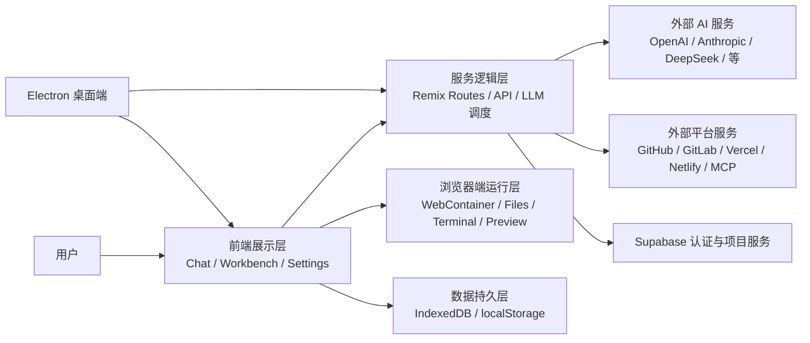
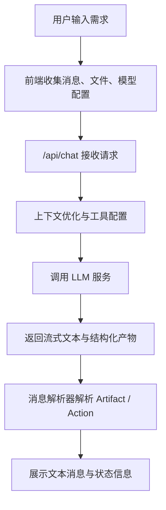
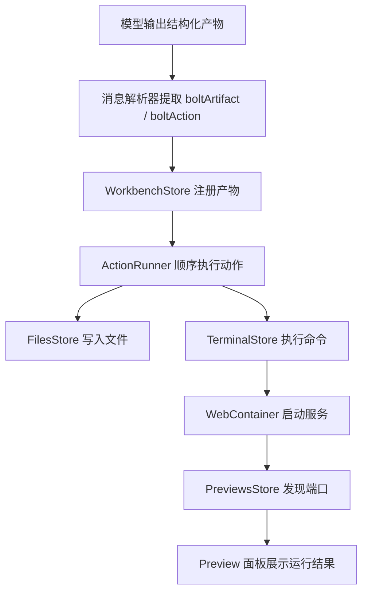

# 第四章 系统设计

## 4.1 系统总体架构设计

### 4.1.1 总体架构设计思路

基于第三章的需求分析可知，本文系统并不是单一的聊天应用，而是一个需要同时承接自然语言交互、模型调用、项目文件组织、浏览器端运行、结果预览、数据持久化和桌面端扩展的综合平台。因此，在系统设计阶段，必须将“开发闭环”作为核心主线，而不是以传统的前后端分离方式机械拆分模块。

围绕这一目标，本文采用分层式总体架构，将系统划分为前端展示层、服务逻辑层、浏览器端运行层、数据持久层和桌面端扩展层。各层之间通过明确的数据边界进行协作：前端展示层负责收集用户输入并呈现对话、代码和预览；服务逻辑层负责处理模型请求、系统配置和第三方接口交互；浏览器端运行层负责项目文件管理、命令执行和预览服务；数据持久层负责会话、快照、用户身份和配置的保存；桌面端扩展层则为系统提供跨平台运行形态。

这种设计方式有两个优势。第一，它能够把“自然语言生成”与“运行验证”统一纳入同一系统链路，避免模型输出与执行环境脱节。第二，它保留了各层相对独立的职责边界，便于后续扩展新的模型服务、部署平台或桌面能力。

### 4.1.2 系统总体架构

从结构上看，系统总体架构如代码块所示。

该架构说明，系统并不是只有一条“用户请求进入后端再返回页面”的简单路径。相反，它同时存在两条核心协作链路：第一条是“用户界面—服务逻辑—模型服务”的语义生成链路，第二条是“用户界面—浏览器端运行层”的执行验证链路。两条链路通过工作台状态和消息解析器耦合在一起，最终形成从自然语言到可运行应用的闭环。

### 4.1.3 前端展示层设计

前端展示层采用 React 组件体系和 Remix 路由结构实现，主要承担三类职责。第一，提供自然语言交互界面，包括消息输入、会话展示、模型选择、提示增强、错误提示和工具调用结果展示。第二，提供工作台界面，包括文件树、代码编辑器、终端、差异视图和预览面板。第三，提供系统配置界面，包括模型设置、外部平台接入、数据管理和用户身份入口。

在设计上，前端展示层强调“主流程集中、扩展能力收纳”。聊天与工作台作为平台核心入口直接面向用户；模型设置、Supabase、GitHub、GitLab、Vercel、Netlify 和 MCP 等能力则通过设置面板统一配置，避免打断主要使用流程。

### 4.1.4 服务逻辑层设计

服务逻辑层建立在 Remix 路由体系之上，由一组 API 路由共同构成。该层主要负责：接收前端的聊天请求；调用大语言模型并返回流式结果；管理模型列表与供应商配置；代理第三方平台接口；处理部署、搜索、Supabase 查询和系统健康检查等请求。

与传统后端不同，本系统的服务逻辑层并不承载全部运行逻辑。模型调用、配置整合和第三方接口协作主要在此层完成，而项目文件写入、依赖安装和运行执行则被下沉到浏览器端运行层。这样设计的原因在于，本系统的目标是尽可能在浏览器侧完成开发闭环，减少对远程执行环境的依赖。

### 4.1.5 浏览器端运行层设计

浏览器端运行层是本系统与普通 AI 对话工具之间最本质的区别所在。该层以 WebContainer 为核心，结合文件状态管理、动作执行队列、终端管理和预览管理，共同承担以下职责：构建项目文件系统；写入模型生成文件；执行依赖安装和启动命令；收集终端输出；发现可用预览端口；在预览异常时反馈错误信息。

在设计上，浏览器端运行层并不是直接暴露给用户的独立模块，而是通过工作台与消息解析器隐式协作。当聊天模块解析出结构化产物后，运行层开始接管执行；当执行完成后，预览与终端输出再反向反馈给用户界面。

### 4.1.6 数据持久层设计

为兼顾即时体验与身份管理，本文采用“本地持久化 + 远程服务”相结合的数据存储方案。聊天记录、项目快照和部分配置数据主要保存在浏览器侧的 IndexedDB 与 localStorage 中，以保证响应速度和恢复便利性；用户登录认证与部分项目服务则通过 Supabase 提供。这样设计可以在不构建复杂后端数据库体系的前提下，较好满足论文型项目对功能完整性和可演示性的要求。

### 4.1.7 桌面端扩展层设计

桌面端扩展层采用 Electron 实现。其设计目标不是重写一套独立系统，而是在保留现有 Web 系统主体不变的前提下，将其封装为跨平台桌面应用。Electron 主进程负责窗口管理、本地协议处理、应用生命周期和自动更新能力；渲染进程则继续承载 Remix + React 的前端界面。这种设计既复用了现有实现，也体现了系统架构的可迁移性。

## 4.2 系统功能模块设计

### 4.2.1 智能生成模块设计

智能生成模块是系统的语义核心，负责将用户自然语言输入转化为可执行的生成任务。该模块主要由聊天请求入口、模型调度器、上下文组织机制和流式结果处理机制组成。用户输入的消息、当前项目文件、模型配置和扩展上下文会被统一组织后提交给模型；模型返回结果后，系统再将普通文本、结构化文件操作和工具调用结果分别分流处理。

在模块边界上，智能生成模块并不直接修改文件系统，而是把生成出的结构化动作交给运行模块执行。这样设计能够将“内容生成”与“动作落地”解耦，提高系统可维护性。

### 4.2.2 多模型统一接入模块设计

为实现多个 AI 提供商的统一管理，系统设计了供应商抽象层与模型管理器。每个供应商以统一 Provider 形式注册，模型管理器负责维护提供商集合、静态模型列表与动态模型列表，并根据用户配置决定当前可用模型。

在设计上，该模块需解决三类问题：一是不同供应商认证方式和参数组织差异；二是不同供应商模型列表来源不一致；三是模型切换时前端展示与后端请求需要保持统一。通过统一抽象后，前端无需关注每个供应商的细节差异，只需操作统一的模型与提供商配置对象。

### 4.2.3 对话交互模块设计

对话交互模块负责承接用户输入并以可理解的方式展示系统执行过程。其内部包含消息输入组件、消息展示组件、模型选择组件、提示增强机制、语音输入入口和 Web 内容引入入口等子功能。该模块的设计重点在于维持多轮会话语义连续性，并将系统内部执行过程转化为用户可感知的界面反馈。

为降低系统黑箱感，对话交互模块在设计上允许展示结构化产物卡片、工具调用卡片和状态提示信息，使用户能够看到系统当前生成了什么、正在执行什么以及发生了什么异常。

### 4.2.4 沙箱运行时模块设计

沙箱运行时模块建立在 WebContainer 之上，负责把模型输出真正转换为可执行项目。该模块可进一步拆分为文件系统管理、动作执行调度、终端输出管理和预览服务管理四个子模块。

文件系统管理负责维护浏览器内项目文件与目录状态；动作执行调度负责按顺序执行写文件、执行命令、构建和启动服务等动作；终端输出管理负责把命令执行过程同步到工作台终端；预览服务管理负责感知开放端口、刷新预览窗口并广播跨标签页更新状态。四者共同构成浏览器侧运行时内核。

### 4.2.5 工作台交互模块设计

工作台交互模块承担“让用户看见和控制项目演化过程”的职责，是系统可解释性的重要组成部分。其主要由文件树、编辑器、终端、预览面板、端口选择器、差异视图和锁定管理组成。

在设计上，该模块需要解决两个关键问题。第一，如何在模型持续生成和动作持续执行的情况下，保持界面状态同步。第二，如何为用户提供足够的可见性，使其能够理解系统修改了哪些文件、哪些内容尚未保存、哪些差异需要关注以及当前预览对应哪一个运行服务。因此，工作台模块在本系统中不是附属能力，而是与聊天模块并列的核心模块。

### 4.2.6 用户与数据管理模块设计

用户与数据管理模块主要负责认证状态、聊天记录、会话描述、项目快照和本地配置数据的保存。考虑到系统强调即时交互和本地闭环，该模块采用混合设计：本地 IndexedDB 用于保存聊天记录和快照，localStorage 用于保存部分配置和连接状态，Supabase 用于承担登录认证及相关远程状态管理。

这种设计使系统在未登录状态下仍可维持较好可用性，同时也为登录用户提供更完整的身份与配置体验。

### 4.2.7 第三方平台接入模块设计

第三方平台接入模块负责与 GitHub、GitLab、Vercel、Netlify、Supabase 和 MCP 服务建立连接。其目标并不是把所有外部服务都深度耦合进主流程，而是通过统一设置入口和接口层，使系统在需要时能够导入代码、访问模型扩展能力、获取项目数据或执行部署。

在模块设计上，该部分通过独立接口、连接状态存储和设置面板展示来实现，与聊天主流程保持相对解耦，仅在必要时参与代码导入、部署发布或工具调用。

### 4.2.8 桌面端扩展模块设计

桌面端扩展模块负责将现有系统封装为 Electron 应用。该模块主要由主进程入口、预加载桥接、窗口与菜单管理、自动更新和本地会话管理构成。其设计原则是最小侵入，即尽量不改变前端主逻辑，而是在外层补充桌面运行所需的生命周期与系统接口管理。

## 4.3 核心业务流程设计

### 4.3.1 用户请求处理流程设计

用户请求处理流程从聊天输入开始，到模型返回结果结束，是系统的首条核心链路。其设计可概括为如下流程。

在该流程中，系统设计的关键不在于“把请求转发给模型”本身，而在于如何将已有文件、上下文摘要、工具调用能力和用户当前设置组织成稳定输入。为避免单一长上下文带来的性能与成本问题，系统在必要时会引入上下文优化与文件选择机制，只将对当前任务有价值的内容提供给模型。

### 4.3.2 模型调用与上下文选择流程设计

由于系统面向项目级代码生成，模型调用必须考虑历史消息、现有文件、用户选择的模型和可能的工具调用环境。因此，本文将模型调用流程设计为“配置解析—上下文筛选—流式调用—结果分流”四步模式。

首先，系统读取当前模型与供应商配置，确认认证信息与启用状态；其次，根据聊天上下文和项目文件决定是否需要摘要生成或上下文裁剪；再次，系统向模型发起流式请求，并允许模型在受控前提下触发工具调用；最后，系统将返回结果按文本消息、文件动作、命令动作和工具调用结果进行拆分，分别交给聊天模块和运行模块处理。

这样的设计可以避免模型调用逻辑与界面逻辑直接耦合，也便于后续扩展更多上下文优化策略。

### 4.3.3 代码生成到运行预览流程设计

模型输出的结构化产物不会直接渲染为普通文本，而是先被消息解析器识别为产物对象与动作对象，再由工作台状态管理器接管。之后，动作执行器依次执行文件写入、构建、启动等任务，并将执行状态同步到工作台和对话界面。

该流程可表示为：

这一设计使系统具备较强的可追踪性。用户不仅能看到最终运行结果，还能看到系统在此之前写了哪些文件、执行了哪些命令、当前动作状态如何。这对于降低 AI 自动化过程中的不确定感非常重要。

### 4.3.4 会话保存与恢复流程设计

为支持连续使用，系统将会话保存与恢复作为独立流程设计。当用户产生新消息或项目发生关键变化时，系统将消息历史和必要元数据保存到本地数据库，并在适当时机保存项目快照。用户重新进入某个聊天时，系统先恢复历史消息，再根据快照恢复对应文件状态，必要时重建项目运行命令。

这种设计兼顾了恢复速度与状态完整性。一方面，聊天历史和快照都存储在本地，读取速度较快；另一方面，快照不必覆盖每一条细小变化，而是围绕关键聊天节点保存，以控制存储成本。

### 4.3.5 部署与外部服务协作流程设计

除生成与运行外，系统还设计了外部平台协作链路。例如，当用户选择部署时，系统会先从当前项目文件中提取可部署内容，再根据目标平台调用不同的部署接口。对于 Vercel，系统还会先检测框架类型，再创建或更新项目并触发部署；对于 Netlify，则会先建立站点并逐个上传文件。对 GitHub 和 GitLab 的接入也遵循类似原则，即在本地系统中完成文件整理，再通过平台接口完成远端交互。

通过把部署与外部平台能力设计为相对独立的协作流程，系统既保留了主流程简洁性，也保证了平台扩展能力。

## 4.4 数据存储设计

### 4.4.1 数据存储设计原则

本系统的数据存储设计遵循三项原则。第一，交互高频、恢复要求高的数据优先在本地存储，以保证响应速度和离线可恢复能力。第二，身份认证和需要远程服务支撑的数据由外部平台承担，以降低系统自建后端复杂度。第三，数据结构尽量贴合系统实际使用路径，避免为论文形式而构建并未真正使用的复杂数据库模式。

基于这些原则，本文采用本地 IndexedDB、localStorage 与 Supabase 混合存储方案。

### 4.4.2 本地会话数据设计

项目当前在 IndexedDB 中建立了 `chats` 和 `snapshots` 两类核心对象存储。`chats` 用于保存会话标识、消息集合、URL 标识、描述信息、时间戳以及部分会话元数据；`snapshots` 用于保存某一聊天节点对应的文件快照和可选摘要。

从逻辑结构上看，本地会话数据可抽象为表 4-1 与表 4-2。

**表 4-1 会话记录结构**

| 字段名 | 类型 | 说明 |
| --- | --- | --- |
| id | String | 会话主键 |
| urlId | String | 路由展示标识 |
| description | String | 会话描述 |
| messages | Array | 聊天消息集合 |
| timestamp | String | 保存时间 |
| metadata | Object | 项目来源、Git 信息等元数据 |

**表 4-2 项目快照结构**

| 字段名 | 类型 | 说明 |
| --- | --- | --- |
| chatId | String | 对应会话标识 |
| chatIndex | String | 快照对应的消息节点 |
| files | Object | 文件映射集合 |
| summary | String | 可选上下文摘要 |

这组设计与系统实际恢复逻辑一致，能够较好支撑聊天回溯、项目恢复和继续生成等需求。

### 4.4.3 本地配置数据设计

除 IndexedDB 外，系统还使用 localStorage 保存主题、模型选择、Supabase 连接状态、锁定文件状态和部分运行配置。这类数据具有“体量小、读取频繁、需即时生效”的特征，因此采用简单键值存储更为合适。

在设计上，这类配置数据不追求复杂查询能力，而更强调即时读取与多模块共享。例如，模型配置直接影响聊天请求构造，Supabase 连接状态影响项目查询与变量拉取，而文件锁定信息则影响工作台写入控制。

### 4.4.4 远程认证与项目数据设计

在远程服务侧，本文主要依赖 Supabase 承担用户身份认证与部分项目服务能力。结合项目当前实现，远程侧重点并不在于托管全部聊天数据，而在于提供用户会话、用户资料和项目相关远程能力。以系统真实实现为准，`profiles` 可以视为用户资料逻辑实体，其核心字段可抽象为：用户标识、用户名、个人简介、头像地址和更新时间等。

这种设计说明，本文系统在当前阶段采用的是“认证远程化、开发状态本地化”的数据组织思路。该方案既降低了远程数据库设计复杂度，也符合平台以浏览器端即时交互为核心的定位。

### 4.4.5 数据存储方案适用性分析

对于本文平台而言，完全依赖远程数据库保存所有开发状态并非最优方案。因为聊天消息、项目快照和文件状态具有更新频繁、实时性强、与浏览器运行环境强绑定等特点，本地存储更利于快速恢复与交互响应。与此同时，身份认证、账户体系和部分项目服务若完全本地化又会限制系统能力。因此，混合存储方案较好平衡了性能、复杂度和可扩展性。

## 4.5 接口设计

### 4.5.1 接口设计原则

本系统接口设计遵循“围绕业务动作组织”的原则，而不是按照传统资源型接口做纯粹的增删改查划分。原因在于，平台中的核心行为是聊天生成、模型配置、运行反馈和第三方协作，而不是标准业务表单处理。因此，接口设计更强调动作语义清晰、输入输出结构稳定以及前后端协作边界明确。

### 4.5.2 聊天与模型接口设计

聊天接口是系统中最重要的核心接口，其主要职责是接收用户消息、文件上下文、模型配置、Supabase 状态和运行控制参数，并返回流式消息结果。该接口的主要输入包括消息数组、当前文件集合、上下文优化开关、模型参数、聊天模式和外部服务状态；输出则包括普通文本流、进度标注、上下文标注、工具调用标注和结构化产物数据。

与之配套的还有模型列表接口，其作用是根据当前供应商配置和认证状态返回可用模型集合，并支持按供应商维度查询模型列表。通过这组接口，前端能够在不感知各供应商底层差异的前提下完成模型选择与调用。

### 4.5.3 系统运行与工作台接口设计

浏览器端运行层虽然大部分执行逻辑发生在前端，但仍需要通过部分路由或消息机制与服务逻辑层协同。例如，Web 搜索接口负责抓取外部 URL 内容并转化为可追加到聊天中的文本；预览相关路由负责建立 WebContainer 预览连接；系统健康接口与诊断接口则用于提供运行环境状态。

这类接口的共同特点是：它们不直接承载聊天语义任务，但对工作台完整运行至关重要，因此应作为支撑性系统接口设计。

### 4.5.4 数据与认证接口设计

在数据与认证方面，系统设计了面向 Supabase 的连接接口和变量查询接口，用于获取项目列表、统计信息和必要的项目信息。同时，前端认证状态通过本地状态存储与 Supabase Auth 协同维护，形成“远程认证 + 本地状态同步”的模式。

此类接口的目标不是替代 Supabase 官方能力，而是在本系统内形成受控代理层，使前端能够在统一接口风格下访问外部服务，同时降低敏感信息处理复杂度。

### 4.5.5 部署与第三方平台接口设计

针对部署与第三方接入，系统设计了 Vercel、Netlify、GitHub、GitLab 等相关接口。其中，Vercel 部署接口除接收文件内容外，还需要根据项目文件推断框架类型；Netlify 部署接口则需先创建站点、计算文件摘要并逐步上传文件。GitHub 与 GitLab 接口主要服务于项目导入、分支获取和部署前交互。

这些接口在设计上遵循同一原则：前端只需提供当前项目文件与平台凭证，平台接口层负责完成具体平台适配逻辑。通过适配层，系统避免了将第三方平台差异扩散到主工作台逻辑中。

## 4.6 安全与异常处理设计

### 4.6.1 运行环境隔离设计

考虑到系统会生成和执行代码，运行环境隔离是总体设计中的关键问题。本文通过 WebContainer 在浏览器内建立相对独立的运行环境，使文件写入、依赖安装和命令执行尽可能局限于浏览器沙箱内部，而不直接影响宿主系统。这一设计在一定程度上降低了运行不受信任代码的风险，也更符合平台强调低门槛与轻量闭环的目标。

### 4.6.2 配置与凭证安全设计

系统涉及模型 API Key、平台接入令牌和用户认证状态等敏感信息，因此在设计上尽量将这些信息收纳到设置面板与受控状态存储中处理，并通过接口代理减少前端对外部平台底层交互细节的直接暴露。同时，认证状态采用本地状态与远程 Auth 协同方式，以便在会话失效时及时更新界面状态并提示用户重新登录。

### 4.6.3 异常反馈设计

为保证平台可用性，异常处理设计遵循“尽早发现、明确提示、允许恢复”的原则。系统在模型调用、动作执行、预览运行和外部服务访问等多个节点设置错误反馈机制。例如，模型调用异常会在聊天区提示，命令执行失败会在终端和告警区域体现，预览异常会被捕获并回传到工作台，外部平台调用失败则通过接口响应和通知组件反馈给用户。

这种设计有助于将复杂系统内部的失败信息转化为用户可理解的信号，减少系统“无响应但不报错”的情况。

### 4.6.4 文件冲突与状态一致性设计

由于系统同时支持模型自动改写和用户手工编辑，文件冲突与状态一致性问题必须在设计阶段考虑。项目中通过文件锁定、未保存状态标识、差异视图和动作串行执行机制，对潜在冲突进行控制。其设计目标不是完全禁止并发修改，而是在保证自动化效率的同时，让用户始终能够知道文件当前处于何种状态，以及哪些操作可能引起覆盖或冲突。

### 4.6.5 跨环境兼容设计

系统既支持浏览器端运行，也支持 Electron 桌面端封装，因此在设计上应尽量减少对单一环境的硬编码依赖。通过将主要业务逻辑保留在 Remix + React 主体中，并把环境相关能力下沉到适配层，系统能够较自然地在 Web 与桌面之间切换。该设计体现了平台的架构弹性，也为后续进一步扩展运行平台提供了基础。

## 4.7 本章小结

本章在需求分析基础上，给出了本文系统的总体设计方案。系统以“自然语言驱动开发闭环”为核心，构建了由前端展示层、服务逻辑层、浏览器端运行层、数据持久层和桌面端扩展层组成的总体架构，并进一步完成了智能生成、多模型接入、对话交互、沙箱运行时、工作台、数据管理和第三方平台接入等模块设计。同时，围绕核心业务流程，本文设计了用户请求处理、模型调用、代码运行预览、会话恢复和部署协作等关键链路，并结合系统实际实现情况给出了本地与远程混合的数据存储方案以及接口设计方案。

上述设计为后续系统实现奠定了结构基础。下一章将在本章设计的基础上，详细介绍各模块的具体实现过程与关键技术细节。

